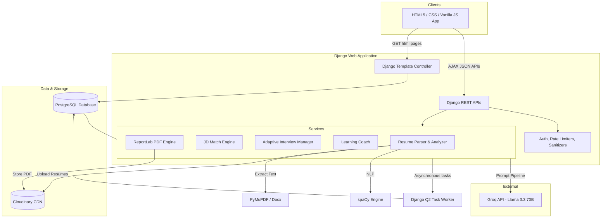
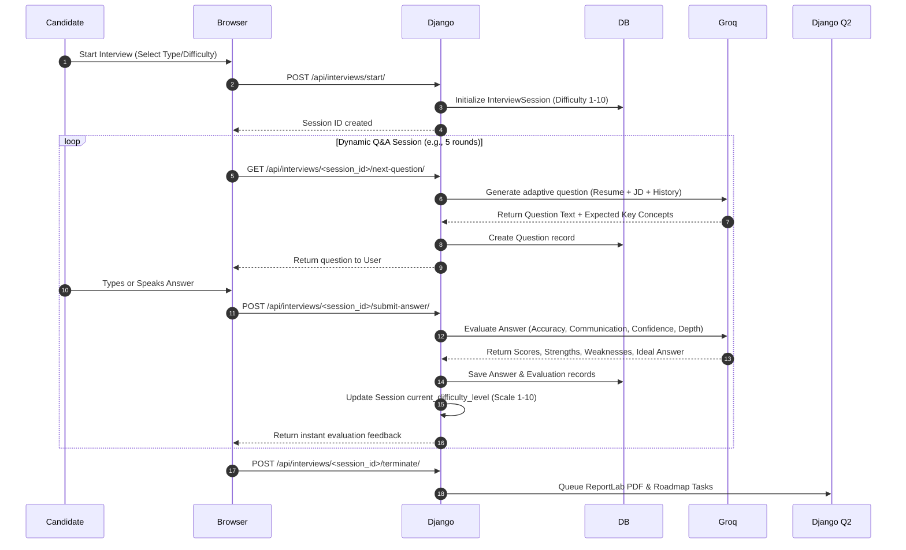

# Software Architecture - InterviewForge AI

This document details the software architecture, data flows, components, and design decisions of the InterviewForge AI platform.

---

## 1. High-Level Architecture Overview

InterviewForge AI follows a service-oriented Monolith architecture, where Django serves as both the MVC web controller (routing page requests to server-side templates) and the API provider (handling async queries from Javascript).

---

## 2. Component Design & Responsibilities

### Frontend Layer (Web UI)
* **HTML5 Templates**: Renders clean semantic templates utilizing server-side variables (Django context).
* **Vanilla CSS (style.css)**: Centralizes style tokens, premium glassmorphism layouts, custom dark theme, hover glows, cards, timelines, and fluid animations.
* **Vanilla JavaScript (main.js & charts.js)**: 
  * Controls page transitions, form submissions, and loading skeletons.
  * Handles audio/text interactive state in the **Interview Arena** via fetch API calls.
  * Draws user progress charts dynamically using **Chart.js**.

### Backend Core & API Gateway (Django)
* **Security & Auth**: Custom middleware manages CSRF verification, rate-limits endpoints (django-ratelimit), and filters input for prompt injections.
* **App-Specific Modules**:
  * `users`: Registers and logs in candidates and recruiters; computes streaks.
  * `resumes`: Parses docs and maintains version tracking and matching scores.
  * `interviews`: Directs mock sessions, maintains state, adjusts difficulty, and stores question logs.
  * `analytics`: Aggregates performance matrices and history maps.

### Background Task Runner (Django Q2)
* Handles heavy operations asynchronously to avoid blocking user threads:
  * Running Groq API analysis on freshly uploaded resumes.
  * Comparing resumes with large JDs.
  * Building detailed PDF reports via ReportLab and syncing with Cloudinary.

### AI Engine (Groq & Llama 3.3 70B)
* Structured prompts execute queries against `Llama-3.3-70b-versatile` using JSON schema modes. Output formatting is strictly controlled on the backend, converting LLM text outputs to validated Python dictionaries.

---

## 3. Core System Data Flows

### A. Resume Analysis & Score Processing Flow

```mermaid
sequenceDiagram
    autonumber
    Candidate->>Browser: Uploads PDF/DOCX Resume
    Browser->>Django: POST /api/resumes/
    Django->>Cloudinary: Store file
    Cloudinary-->>Django: Return URL
    Django->>DB: Save Resume metadata (Version, File URL)
    Django->>Django Q2: Queue Asynchronous Analysis Task
    Django-->>Browser: HTTP 202 Accepted (Task Queued)
    
    rect rgb(20, 20, 35)
        Note over Django Q2, Groq: Asynchronous Execution
        Django Q2->>PyMuPDF: Read and extract text from PDF/DOCX
        PyMuPDF-->>Django Q2: Return raw text
        Django Q2->>spaCy: Extract basic entities (Names, Skills, Companies)
        Django Q2->>Groq: Query ResumeAnalyzer Service (Prompt + Text)
        Groq-->>Django Q2: Return JSON Score & Rewritten Bullets
        Django Q2->>DB: Write ResumeAnalysis record
    end

    Browser->>Django: GET /api/resumes/<id>/status/ (Polling)
    Django-->>Browser: Return Status (Completed / Analyzing)
```

### B. Adaptive Interview Loop

---

## 4. Architectural Patterns

1. **MVC Pattern (Server-Side Rendering)**: Ensures speedy initial loads and search-engine visibility for candidate landing and public resources.
2. **AJAX API Bridge**: Uses asynchronous JavaScript client requests to keep mock interviews and matching states responsive without full page refreshes.
3. **Service Layer Isolation**: AI API code is isolated from models and views. The `ai_services.py` modules act as standalone utility classes that can be tested independently of the database.
4. **Idempotent Analysis**: Resume and JD analyses are saved in DB records linked by foreign key relationships. If the user requests a rematch, the DB checks for cached matching tables before calling external APIs.
5. **Stateful Session Store**: Mock interview histories, question logs, and candidate records are persisted cleanly, letting candidates pause and resume mock runs.
